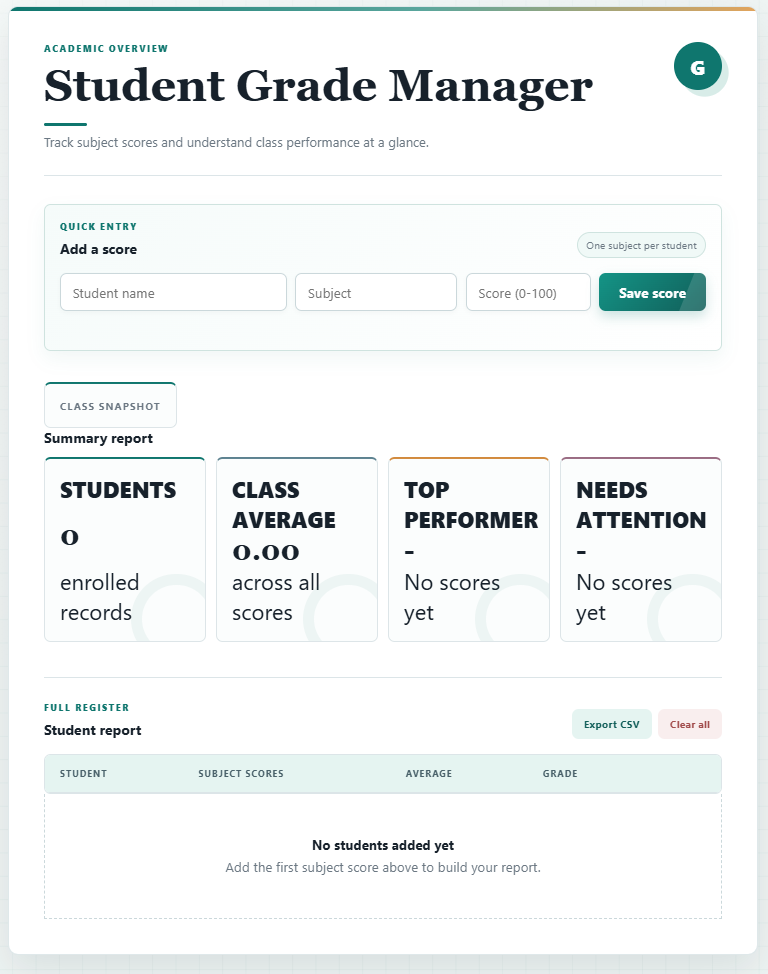
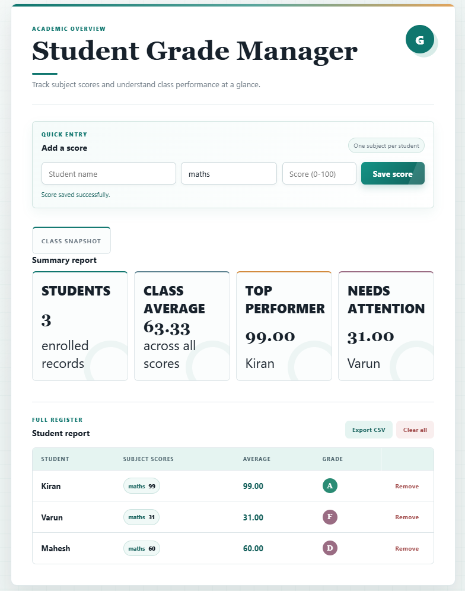

# 🎓 Student Grade Management System

> A simple web-based Student Grade Management System built using **Core Java, HTML, CSS, and JavaScript**.


---

## 📌 Overview

The **Student Grade Management System** is a beginner-friendly web application developed to manage student marks and generate basic academic performance statistics.

The application allows users to enter student details through a web interface. The Java backend processes the information, stores student records using an `ArrayList`, and performs calculations such as:

* Average marks
* Highest marks
* Lowest marks
* Student grades

The project uses **Core Java** and Java's built-in HTTP server instead of frameworks such as Spring Boot. This keeps the implementation simple and focuses on understanding fundamental programming and web development concepts.

---

## ✨ Features

* ➕ Add student name and marks
* 📋 Display all students
* 📊 Calculate average marks
* 🔝 Find highest marks
* 🔽 Find lowest marks
* 🎓 Calculate student grades
* ✅ Validate marks between `0` and `100`
* 🌐 Web-based user interface
* 🔗 Connect JavaScript with Java using HTTP
* 📦 Store student records using `ArrayList`
* 📱 Simple and user-friendly interface

---

## 🛠️ Technologies Used

| Technology          | Purpose                                         |
| ------------------- | ----------------------------------------------- |
| **Java 17+**        | Backend application logic                       |
| **ArrayList**       | Temporary storage of student records            |
| **Java HttpServer** | Handles communication between frontend and Java |
| **HTML5**           | Structure of the web interface                  |
| **CSS3**            | Styling and layout                              |
| **JavaScript ES6+** | Frontend interaction and application logic      |
| **Fetch API**       | Communication between JavaScript and Java       |
| **Git**             | Version control                                 |
| **GitHub**          | Source code hosting                             |

---

## 🚫 No Frameworks

This project intentionally does **not** use:

* Spring / Spring Boot
* Hibernate
* JPA
* MySQL
* React
* Angular
* Microservices

The purpose is to build the application using **Core Java fundamentals** before moving to advanced frameworks and databases.

---

## 🏗️ Architecture

The application follows a simple frontend-to-backend architecture:

```text
┌──────────────────────────────┐
│           Browser            │
│                              │
│       HTML + CSS + JS        │
└──────────────┬───────────────┘
               │
               │ HTTP Request
               ▼
┌──────────────────────────────┐
│       Java HTTP Server       │
│                              │
│          Main.java           │
└──────────────┬───────────────┘
               │
               ▼
┌──────────────────────────────┐
│       StudentManager         │
│                              │
│       ArrayList<Student>     │
│                              │
│  • Add Student               │
│  • Calculate Average         │
│  • Find Highest              │
│  • Find Lowest               │
│  • Calculate Grade           │
└──────────────┬───────────────┘
               │
               ▼
┌──────────────────────────────┐
│           Student            │
│                              │
│  • Name                      │
│  • Marks                     │
│  • Grade                     │
└──────────────────────────────┘
```

---

## 🔄 Application Flow

When a user adds a student, the application follows this process:

```text
User enters student details
            ↓
       HTML Form
            ↓
       JavaScript
            ↓
         fetch()
            ↓
    Java HTTP Server
            ↓
      StudentManager
            ↓
    ArrayList<Student>
            ↓
      Java Processing
            ↓
         Response
            ↓
       JavaScript
            ↓
        Update UI
```

### Example

The user enters:

```text
Name  : Rahul
Marks : 85
```

JavaScript sends the information to the Java application.

Java creates a `Student` object:

```text
Student
├── name  = Rahul
└── marks = 85
```

The object is then stored in the `ArrayList`.

---

## 📂 Project Structure

```text
student-grade-management-system/
│
├── java/
│   ├── Main.java
│   ├── Student.java
│   └── StudentManager.java
│
├── web/
│   ├── index.html
│   ├── style.css
│   └── script.js
│
├── .gitignore
└── README.md
```

### Java Files

#### `Student.java`

Represents an individual student.

Stores information such as:

```text
Name
Marks
Grade
```

#### `StudentManager.java`

Handles student-related operations using an `ArrayList`.

Responsibilities include:

* Adding students
* Returning student records
* Calculating average marks
* Finding highest marks
* Finding lowest marks
* Calculating grades

#### `Main.java`

Acts as the entry point of the Java application and starts the built-in Java HTTP server.

---

## 📊 Grading System

The application uses the following grading scale:

|    Marks | Grade |
| -------: | :---: |
| 90 – 100 |   A   |
|  80 – 89 |   B   |
|  70 – 79 |   C   |
|  60 – 69 |   D   |
|   0 – 59 |   F   |

---

## 🧮 Calculations

### Average Marks

The average is calculated using:

```text
Average = Total Marks / Number of Students
```

Example:

```text
80 + 90 + 70 = 240

240 / 3 = 80
```

### Highest Marks

The program checks each student's marks and keeps track of the highest value.

### Lowest Marks

The program checks each student's marks and keeps track of the lowest value.

The calculations are implemented using basic Java concepts:

* Variables
* `for` loops
* `if` conditions
* Methods

---

## 🚀 Getting Started

### Prerequisites

Before running the project, install:

* **Java JDK 17 or later**
* **VS Code** or **IntelliJ IDEA**
* A modern web browser
* **Git** — optional, for cloning the repository

Check your Java installation:

```bash
java -version
```

Check the Java compiler:

```bash
javac -version
```

---

## 📥 Installation

### 1. Clone the Repository

```bash
git clone https://github.com/YOUR-USERNAME/student-grade-management-system.git
```

Move into the project directory:

```bash
cd student-grade-management-system
```

### 2. Project Structure

Make sure the project contains:

```text
student-grade-management-system/
│
├── java/
└── web/
```

---

## ▶️ Running the Application

### Step 1 — Open the Java directory

```bash
cd java
```

### Step 2 — Compile the Java files

```bash
javac *.java
```

### Step 3 — Start the Java application

```bash
java Main
```

The Java HTTP server will start on the configured local port.

### Step 4 — Open the Application

If your Java application is configured to use port `8080`, open:

```text
http://localhost:8080
```

> **Note:** Make sure the port number in this README matches the port configured in your `Main.java`.

---

## 🧪 Example

### Input

```text
Student Name    Marks
---------------------
Rahul           85
Anu             92
Kiran           67
Priya           78
```

### Output

```text
Average : 80.50
Highest : 92
Lowest  : 67
```

Grades:

```text
Rahul  → B
Anu    → A
Kiran  → D
Priya  → C
```

---

## 🧠 Core Java Concepts Used

This project focuses on fundamental Java concepts rather than advanced frameworks.

### Classes and Objects

The `Student` class represents a student.

Example:

```java
Student student = new Student("Rahul", 85);
```

### ArrayList

Student objects are stored using:

```java
ArrayList<Student>
```

### Methods

Separate methods are used for different operations:

```text
addStudent()
getStudents()
calculateAverage()
getHighest()
getLowest()
calculateGrade()
```

### Loops

`for` loops are used to process multiple student records.

### Conditional Statements

`if` statements are used for:

* Input validation
* Finding highest marks
* Finding lowest marks
* Grade calculation

### HTTP Communication

Java's built-in `HttpServer` allows the browser-based frontend to communicate with the Java application.

---

## 🔗 Frontend–Backend Communication

The frontend communicates with the Java backend using HTTP requests.

```text
JavaScript
     │
     │ Fetch API
     ▼
Java HTTP Server
     │
     ▼
StudentManager
     │
     ▼
ArrayList<Student>
     │
     ▼
HTTP Response
     │
     ▼
JavaScript
     │
     ▼
Web Page
```

---

## 🔌 API Endpoints

> The endpoints below should match the actual endpoints implemented in `Main.java`.

| Method | Endpoint    | Description       |
| ------ | ----------- | ----------------- |
| `POST` | `/students` | Add a new student |
| `GET`  | `/students` | Get all students  |
| `GET`  | `/average`  | Get average marks |
| `GET`  | `/highest`  | Get highest marks |
| `GET`  | `/lowest`   | Get lowest marks  |

The frontend uses JavaScript's `fetch()` method to communicate with these endpoints.

---

## 🔐 Input Validation

The application validates student marks before processing them.

### Valid

```text
0 – 100
```

### Invalid

```text
Below 0
Above 100
Empty student name
```

This prevents invalid marks from being added to the system.

---

## 🎯 Learning Objectives

This project was created to practice:

* Core Java programming
* Object-oriented programming fundamentals
* Classes and objects
* Constructors
* Getters and setters
* Java `ArrayList`
* Methods
* Loops
* Conditional statements
* Input validation
* HTML forms
* CSS styling
* JavaScript DOM manipulation
* JavaScript `fetch()`
* Basic HTTP communication
* Frontend-backend integration
* Git and GitHub

---

## 💡 Why Core Java Instead of a Framework?

The project intentionally starts with Core Java to understand the fundamentals behind a backend application.

The learning progression is:

```text
Core Java
    ↓
Classes & Objects
    ↓
ArrayList
    ↓
Methods & Logic
    ↓
HTTP Communication
    ↓
JavaScript
    ↓
Frontend + Backend
    ↓
Future Frameworks
```

Understanding these fundamentals makes it easier to learn frameworks such as Spring Boot later.

---

## ⚠️ Current Limitations

The current version stores student records in an in-memory `ArrayList`.

Therefore:

> Student data will be lost when the Java application is stopped.

The application does not currently use a database or persistent storage. Data can be exported as a CSV file instead.


## 📸 Screenshots






---

## 🤝 Contributing

Contributions and suggestions are welcome.

If you would like to improve the project:

1. Fork the repository
2. Create a new branch
3. Make your changes
4. Commit your changes
5. Push the branch
6. Create a Pull Request

---

## 📄 License

This project is created for **educational and learning purposes**.

---

## 👨‍💻 Author

**G N Shanthaveeragowda**

Student / Software Developer

GitHub: `https://github.com/gn-shanthaveeragowda`

---

⭐ If you find this project useful for learning **Core Java and web development**, consider giving the repository a star.

---

## 📌 Project Summary

```text
Student Grade Management System

Frontend:
HTML + CSS + JavaScript

Backend:
Core Java

Data Storage:
ArrayList

Communication:
HTTP + Fetch API

Version Control:
Git + GitHub
```
